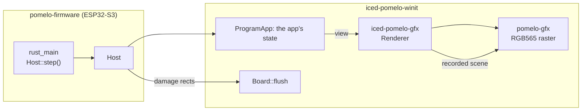

# 纯 Rust 开发的 UI 框架和 UI 系统（ESP32-S3）

**简体中文** | [English](README_EN.md)

> Version 0.1.0

## 📖 项目简介

这个项目是为 微雪 ESP32-S3-Touch-AMOLED-2.16 触屏开发板开发的纯 Rust UI 框架和 UI 系统。

项目基于 **ESP-IDF v6.1** 构建。  

- **测试平台**：目前固件仅在 **微雪 ESP32-S3-Touch-AMOLED-2.16** 上进行过测试。
- **可移植性**：应用写在 **iced** 之上，而它们在这里运行所依赖的平台层——事件循环、面板 RGB565 缓冲、脏区追踪、文本与字体（`iced-pomelo-winit`）以及光栅化引擎（`pomelo-gfx`）——通过两道很薄的缝与硬件解耦：面板与触摸输入，以及板载外设（`pomelo-hal` 的 trait）。移植只需提供帧缓冲刷新、触摸输入，以及这些 trait 的一份实现；两道缝之上都没有任何东西知道这是 ESP32-S3。
- **产品官方文档**：[微雪 ESP32-S3-Touch-AMOLED-2.16 文档](https://docs.waveshare.net/ESP32-S3-Touch-AMOLED-2.16)

---

## 🚀 快速上手

如需克隆包含所有子模块的完整工程：

```bash
git clone --recurse-submodules https://github.com/pomelos-on-sale/pomelo-ui.git
```

### 1. 跑测试

每个应用都是标准的 iced 程序。它自己的测试用 `iced_test` 驱动真实的 widget 树，全程不碰平台层。

仓库**根目录没有 cargo 清单**，这是有意的：每份交付物都是一个独立项目，各自带 `Cargo.lock`，
只要它要构建 iced 就各自带一份 patch 表。所以在根目录 `cargo test` 什么也测不到；要跑的是这几个：

```bash
# 七个应用：一个他们自己的项目（`pomelo-apps`，七个 crate），
# iced 直接来自 crates.io，没有板子、没有 patch。它们的测试与宿主无关——
# 按 iced 的方式驱动状态、message 与 view()，不碰 HAL、不画像素。
cd pomelo-apps && cargo test --workspace

# 我们自己的库：pomelo-hal、pomelo-gfx、iced-pomelo-gfx、iced-pomelo-winit，
# pomelo-widgets（应用之间共享的 widget）。图标那个 pomelo-material-symbols 是
# 独立仓库、按 revision 引用，测试在它自己那边跑。
cd pomelo-gfx && cargo test
cd ../iced-pomelo-winit && cargo test
cd ../pomelo-hal && cargo test
```

> 固件镜像（`pomelo-firmware/firmware/components/rust_main`）自身持有一份 iced 的 patch 表，因为 cargo 只从依赖图的根读 `[patch]`。

### 2. 在窗口里跑一个应用

桌面端每个应用都是标准 iced 程序，`cargo run` 开的就是一个真窗口（iced 自己的 `iced_winit` + winit）：

```bash
cd pomelo-apps && cargo run -p calculator
cd pomelo-apps && cargo run -p music-player   # 音乐来自 HAL 的桌面模拟器，后面没有硬件
```

> **在 WSLg 上窗口一闪而过？** 那是环境，不是代码。winit 0.30 用标准变量选后端
> （`WAYLAND_DISPLAY` 在就用 Wayland，否则 X11 —— `WINIT_UNIX_BACKEND` 在 0.30 已经删掉），
> 而 WSLg 的 Wayland 服务器会在窗口刚建好时重置连接：iced 的循环于是正常返回、进程退出
> （退出码 0，只剩下几行 `Io error: Connection reset by peer`）。让它走 X11 就行：
>
> ```bash
> env -u WAYLAND_DISPLAY cargo run
> ```
>
> X11 需要 `libxkbcommon-x11-0` 与 `libxcb-xkb1`（`sudo apt install libxkbcommon-x11-0 libxcb-xkb1`）。

> **窗口很卡？用 `--release` 跑。** 这里的桌面渲染器是 iced 的 `tiny-skia`——一个**软件**光栅化
> 器，debug 配置在它上面要慢一个数量级。用 hello 的签名实测（在 `pomelo-apps/hello` 里
> `cargo run --release --example frame_rate`，X11，1024x768 窗口）：`--release` 下动画为
> **220-1400 fps**，而画完之后**一帧什么都不用重画**——因为 app 把“除正在生长那一段以外”的
> 一切都缓存了，没变的一帧不产生任何脏区。同一测量在 debug 配置下是 4-6 fps，全部花在那段
> 无法缓存的一笔上；换成 480x480 窗口（这幅画原本的画布）像素再少 3.4 倍。缓存了什么、为什么，
> 见 `pomelo-apps/hello/src/canvas.rs`。

### 3. 烧录至硬件设备

- 安装 **ESP-IDF** (v6.1 或兼容版本)
- 安装 **Rust Xtensa 工具链** (`espup`)
- 将开发板用 USB 连接至电脑

```bash
cd pomelo-firmware/firmware

# 编译并烧录固件
./flash.sh
```

按下 PWR 键开机。开机后进入桌面，左右滑动翻页，点击应用图标打开应用，左按钮最小化应用，右按钮退出应用，中键长按关机。  

---

## 🎨 iced 与它依赖的平台层

UI 直接用 **iced** 自己的 widget 与 `canvas`（是真 API，不是仿制品），并通过 submodule 引入在 `iced/` 下：这块板子碰坏了其中两件事——它没有 64 位原子操作，`fontdb` 又需要 `mmap`。

属于我们的是它下面这一层：

- **`iced-pomelo-winit`**（包名 `iced_winit`）—— 平台层：事件循环（`Host`，以及面板测试直接驱动的 `Application`）、面板 RGB565 缓冲、脏区追踪与呈现、字体安装。它占的是桌面上 `iced_winit` 的位置，只是没有窗口。
- **`iced-pomelo-gfx`** —— iced 的渲染器契约，实现在 `pomelo-gfx` 之上：与 `iced_tiny_skia`、
  `iced_wgpu` 在栈里同一位，把一帧的绘制命令录下来交给平台层去回放。
- **`pomelo-gfx`** —— RGB565 光栅化引擎：矩形、圆角矩形、带渐变的描边、字形蒙版。
- **`pomelo-hal`** —— 把板载外设（电源、Wi-Fi、音频、麦克风、IMU）收在几个 trait 之后，旁边配有它们的纯 Rust 模拟实现。它里面没有任何硬件代码、也没有 `extern "C"`：ESP32-S3 的实现住在固件那边（`pomelo-firmware/firmware/pomelo-hal-esp32`），紧挨着它所声明的 C 驱动，由 `rust_main` 选中并注入 launcher。桌面上实现的正是这几个 trait。
- **应用自己拥有的部分** —— 与框架无关的那部分现在是应用内部的模块，自身零依赖：计算器的 `model` 与 `format`、签名的 `artwork`、播放器的 `model`、终端的 `shell` 与 `commands`。应用里其余的全是 widget，而每个应用就是 `pomelo-apps/<名字>`，测试套件就在旁边。

应用是 launcher 树里的一个 widget，不是进程、不是窗口：点一下磁贴就换掉 launcher 的屏幕，被托管应用的 message 会路由给它。但每个应用本身都是标准的 iced 程序（用 `iced::application(...)` 写出来的），固件把它交给平台层的 `Host` 来启动——`Host` 持有它的状态、把窗口事件喂进去、把它的 `view()` 画出来。动画就是普通订阅（签名与播放器用 `iced::window::frames()`），不是什么框架钩子：跑循环的人只要还有订阅活着，每轮迭代就产一帧；一旦没有订阅、没有脏区、也没有 message 要处理，就一帧都不产。



---

## 🙌 欢迎发起 Issue 和提交 Pull Request

欢迎为本项目贡献代码、扩充组件、优化性能或修复问题。提交步骤：

- 创建 Issue 描述问题或计划添加的新特性
- Fork 仓库并创建新分支
- 本地开发与测试（用项目自己的测试套件：`cd pomelo-apps && cargo test --workspace`）
- 提交 Pull Request 并关联对应 Issue

---

## 🤖 AI 编写声明

本项目所有代码（底层驱动、UI 框架与应用程序）全部由 **AI 编写生成**。受限于生成机制与验证深度，代码质量可能存在以下问题：

- **功能不全与边界异常**：部分功能实现可能不够完备，在边界情况或非预期输入下可能表现异常。
- **潜在 Bug 与稳定性隐患**：缺少系统性的自动化测试覆盖，可能潜藏未被发现的逻辑缺陷或崩溃风险。
- **性能与资源开销未调优**：代码未做深度的性能分析与优化，可能存在内存浪费或运行效率低下的问题。
- **可读性与可维护性不足**：多轮增量生成缺乏顶层长远规划，可能存在架构松散、逻辑冗余及规范不统一的问题。

> **免责声明**：本项目仅作为实验与技术探索，请自行承担用于生产环境的风险和后果。

---

## 🛠️ 开发者踩坑提醒

### 1. 纯电池供电/拔掉 USB 线后系统无限重启

- **问题**：插着 USB 数据线调试时一切正常，但拔掉 USB 线使用电池供电开机时，系统会立即死机并陷入“开机 -> 重启 -> 开机”的无限循环。
- **原因**：ESP32-S3 使用片上 USB 作为串口控制台。当拔掉 USB 线后，底层驱动检测不到电脑连接，写输出会直接报错；而 Rust 标准库的 `println!` 在写入报错时会强制触发 `panic!`，进而导致整机硬件复位重启。此外，电池刚接入时的电流波动也容易触发芯片默认的欠压复位。
- **解决方法**：
  1. **拦截标准输出写入**：在 `pomelo-firmware/firmware/main/CMakeLists.txt` 中配置链接器参数 `-Wl,--wrap=write`, `-Wl,--wrap=esp_vfs_write`，并在 `pomelo-firmware/firmware/main/main.c` 中实现 `__wrap_write`，当检测到未插 USB 时伪装写入成功，避免触发 Rust Panic。
  2. **控制台设为无缓冲直写模式**：在 `pomelo-firmware/firmware/main/main.c` 的 `app_main()` 入口调用 `setvbuf(stdout, NULL, _IONBF, 0)` 和 `setvbuf(stderr, NULL, _IONBF, 0)`，防止底层缓冲区写满堵塞。
  3. **禁用芯片底层欠压检测**：在 `pomelo-firmware/firmware/sdkconfig.defaults` 中设置 `# CONFIG_ESP_BROWNOUT_DET is not set`，避免电池瞬时电流波动引发硬件误复位。

### 2. 显存争抢与内存不足

- **问题**：屏幕分辨率为 480x480，一帧图像就需要近 450KB 内存。而 ESP32-S3 片内 SRAM 总共只有 512KB。如果 Rust 的常规代码（如字符串、数组、UI 树）也挤在片内 SRAM 中，内存很快就会被耗尽，导致屏幕 DMA 申请不到内存而花屏或死机。
- **原因**：片内 SRAM 速度最快，应该留给屏幕 DMA 刷新使用；板载另外附带了 8MB/16MB 的大容量外部 PSRAM，但系统默认倾向于优先使用片内 SRAM。
- **解决方法**：
  1. **常规堆分配全量导向 PSRAM**：在 `pomelo-firmware/firmware/sdkconfig.defaults` 中配置 `CONFIG_SPIRAM_USE_MALLOC=y` 与 `CONFIG_SPIRAM_MALLOC_ALWAYSINTERNAL=0`，使所有常规堆内存分配默认全部走外部 PSRAM。
  2. **严格预留片内 SRAM**：在 `pomelo-firmware/firmware/sdkconfig.defaults` 中配置 `CONFIG_SPIRAM_MALLOC_RESERVE_INTERNAL=32768`，为内部 SRAM 严格保留 32KB 独占空间，专门供 `board_hal.c` 中的 DMA Ping-Pong 双缓冲（`s_dma_chunk`）和 FreeRTOS 关键任务独占使用。
