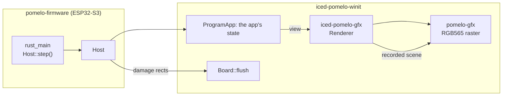

# Pure Rust UI System & Framework (ESP32-S3)

[简体中文](README.md) | **English**

> Version 0.1.0

## 📖 Introduction

This project is a pure Rust UI framework and UI system designed for Waveshare ESP32-S3-Touch-AMOLED-2.16 touch display development boards.

Built on **ESP-IDF v6.1**.

- **Testing Platform**: Currently tested on the **Waveshare ESP32-S3-Touch-AMOLED-2.16** development board.
- **Portability**: The applications are written against **iced**, and the platform they run on here -- the event loop, the panel's RGB565 buffers, damage tracking, text and fonts (`iced-pomelo-winit`), and the rasteriser (`pomelo-gfx`) -- is decoupled from the board by two thin seams: the panel and touch input, and the board's accessories (`pomelo-hal`'s traits). Porting means providing a framebuffer flush, touch input and one implementation of those traits; nothing above either seam knows the board is an ESP32-S3.
- **Official Documentation**: [Waveshare ESP32-S3-Touch-AMOLED-2.16 Documentation](https://docs.waveshare.net/ESP32-S3-Touch-AMOLED-2.16)

---

## 🚀 Quick Start

To clone the complete project with all submodules:

```bash
git clone --recurse-submodules https://github.com/pomelos-on-sale/pomelo-ui.git
```

### 1. Run the Tests

Every app is an ordinary iced program. Its own suite drives the real widget tree with `iced_test` and never sees a platform layer.

There is **no cargo manifest at the repository root**, on purpose: each deliverable is a project of its own, with its own `Cargo.lock` and -- if it builds iced at all -- its own patch table. So `cargo test` from the root tests nothing; these are the suites:

```bash
# The applications: a project of their own -- `pomelo-apps`, seven crates -- with iced
# straight from crates.io, no board and no patches. Their suites are host-free: state, messages and
# view() driven as iced drives them, with no HAL and no pixels.
cd pomelo-apps && cargo test --workspace

# The libraries we own: pomelo-hal, pomelo-gfx, iced-pomelo-gfx, iced-pomelo-winit and
# pomelo-widgets (the widgets the apps share). pomelo-material-symbols (the icons) is a repository
# of its own, pinned by revision, and its suite runs there.
cd pomelo-gfx && cargo test
cd ../iced-pomelo-winit && cargo test
cd ../pomelo-hal && cargo test
```

> The board image (`pomelo-firmware/firmware/components/rust_main`) carries its own copy of the iced patch table, because cargo reads `[patch]` only from the root of a dependency graph.

### 2. Run an App in a Window

On a desktop every app is an ordinary iced program, and `cargo run` opens a real window (iced's own `iced_winit` over winit):

```bash
cd pomelo-apps && cargo run -p calculator
cd pomelo-apps && cargo run -p music-player   # the music comes from the HAL's desktop simulator
```

> **The window flashes and disappears under WSLg?** That is the environment, not the code. winit 0.30 picks its backend from the standard variables (`WAYLAND_DISPLAY` if it is set, otherwise X11 -- `WINIT_UNIX_BACKEND` was removed in 0.30), and WSLg's Wayland server resets the connection as soon as the window exists: iced's loop returns cleanly and the process exits (status 0, a few `Io error: Connection reset by peer` lines and nothing else). Ask for X11 instead:
>
> ```bash
> env -u WAYLAND_DISPLAY cargo run
> ```
>
> X11 needs `libxkbcommon-x11-0` and `libxcb-xkb1` (`sudo apt install libxkbcommon-x11-0 libxcb-xkb1`).

> **Is the window laggy? Run it in `--release`.** The desktop renderer here is iced's `tiny-skia`, a *software* rasterizer, and the debug profile is an order of magnitude slower with it. Measured with the hello signature (`cargo run --release --example frame_rate` in `pomelo-apps/hello`, X11, a 1024x768 window): `--release` animates at **220-1,400 fps**, and a *finished* picture costs nothing at all, because the app caches everything but the piece that is still growing -- an unchanged frame damages no pixels. The same measurement in the debug profile is 4-6 fps, all of it the one stroke that cannot be cached; a 480x480 window (the panel the artwork was drawn for) has 3.4x fewer pixels again. `pomelo-apps/hello/src/canvas.rs` says what is cached and why.

### 3. Flash to Hardware Device

- Install **ESP-IDF** (v6.1 or compatible)
- Install **Rust Xtensa Toolchain** (`espup`)
- Connect the board to your computer via USB

```bash
cd pomelo-firmware/firmware

# Build and flash the firmware
./flash.sh
```

Press the PWR key to power on. After booting into the desktop launcher:
- Swipe left / right to change pages
- Tap an app icon to launch the application
- Press Left Button to minimize the current application
- Press Right Button to exit the current application
- Long-press Middle Button to power off

---

## 🎨 iced, and the Platform It Runs On

The UI is built from **iced**'s own widgets and its `canvas` — the real API, not a lookalike — with iced's crates submoduled under `iced/` for the two things this board breaks: it has no 64-bit atomics, and `fontdb` wants `mmap`.

What is ours is the layer underneath:

- **`iced-pomelo-winit`** (package `iced_winit`) — the platform: the event loop (`Host`, and the `Application` a panel test drives directly), the panel's RGB565 buffers, damage tracking and presentation, and the font installer. It occupies the place `iced_winit` occupies on a desktop, without a window.
- **`iced-pomelo-gfx`** — iced's renderer contract, implemented over `pomelo-gfx`: the same position in the stack as `iced_tiny_skia` and `iced_wgpu`, recording a frame's commands for the host to replay.
- **`pomelo-gfx`** — the RGB565 rasteriser: rectangles, rounded rectangles, strokes with gradients, glyph masks.
- **`pomelo-hal`** — the board's accessories (power, Wi-Fi, audio, microphone, IMU) as traits, with a pure-Rust simulation of them next to them. No hardware, no `extern "C"`: the ESP32-S3 implementation lives in the firmware, in `pomelo-firmware/firmware/pomelo-hal-esp32`, beside the C drivers it declares, and `rust_main` picks it and passes the resulting board into the launcher. On the desktop those traits are what a simulator board implements.
- **What the apps own** — the parts of an app that are not about a framework are modules inside it, with no dependencies of their own: the calculator's `model` and `format`, the signature's `artwork`, the player's `model`, the terminal's `shell` and `commands`. Everything else in an app is widgets, and every app is in `pomelo-apps/<name>` with its test suite next to it.

An app is a widget inside the launcher's tree, not a process or a window: tapping a tile swaps the launcher's screen and the hosted app's messages are routed to it. Each one is nevertheless an ordinary iced program — it is written with `iced::application(...)` — and the firmware boots it by handing that program to the platform's `Host`, which owns its state, feeds it window events and paints what its `view()` returns. Animation is a subscription like any other (`iced::window::frames()` for the signature and the media player), not a framework hook: whoever runs the loop produces a frame per iteration while something is subscribed, and produces none once nothing is subscribed, nothing is damaged and there is nothing left to say.



---

## 🙌 Contributing

Contributions, bug reports, and pull requests are warmly welcome! Workflow:

- Create an Issue describing the bug or proposed feature
- Fork the repository and create your feature branch
- Develop and test locally with the project's own suite (`cd pomelo-apps && cargo test --workspace`)
- Submit a Pull Request referencing the corresponding Issue

---

## 🤖 AI Disclaimer

All code in this project (underlying drivers, UI framework, and applications) is **generated by AI**. Due to generation constraints and limited verification depth, the following code quality issues may exist:

- **Incomplete Features & Edge Case Quirks**: Certain features may lack full implementations or behave unexpectedly under unusual edge conditions.
- **Potential Bugs & Stability Hazards**: Lacks exhaustive automated test suites; hidden logic defects or panic risks may exist.
- **Unoptimized Performance & Resource Usage**: Not deeply profiled; potential heap allocations or suboptimal rendering loops may lead to unnecessary overhead.
- **Readability & Architectural Drift**: Multi-round incremental generation lacks strict top-down architecture, leading to loose modularity or code redundancy.

> **Disclaimer**: This project is strictly for technical exploration and PoC experimentation. Users assume all risks and responsibilities when using it in production environments.

---

## 🛠️ Developer Gotchas & Tips

### 1. Infinite Reboot Loop on Battery Power (USB Unplugged)

- **Symptom**: System works fine with USB plugged in, but immediately reboots in an infinite loop upon booting with battery power alone.
- **Root Cause**: ESP32-S3 uses on-chip USB-Serial-JTAG as the main console. When the USB cable is disconnected, driver write operations return errors (Broken Pipe / EIO). In Rust's standard library, `println!` panics on write failure, triggering a hardware restart. Initial battery voltage drops may also trigger brownout detection.
- **Solution**:
  1. **Intercept standard output**: Wrap `write` and `esp_vfs_write` linker flags (`-Wl,--wrap=write`, `-Wl,--wrap=esp_vfs_write` in `pomelo-firmware/firmware/main/CMakeLists.txt`), implementing `__wrap_write` in `pomelo-firmware/firmware/main/main.c` to silently fake successful writes when USB is disconnected.
  2. **Unbuffered console mode**: Call `setvbuf(stdout, NULL, _IONBF, 0)` and `setvbuf(stderr, NULL, _IONBF, 0)` in `app_main()` to prevent output buffers from filling up.
  3. **Disable brownout reset**: Set `# CONFIG_ESP_BROWNOUT_DET is not set` in `pomelo-firmware/firmware/sdkconfig.defaults` to prevent voltage fluctuations from triggering resets.

### 2. SRAM Contention and Out-of-Memory

- **Symptom**: At 480x480 resolution, a single frame requires ~450KB memory. ESP32-S3 only has 512KB internal SRAM. If normal Rust heap allocations (strings, vectors, UI trees) share internal SRAM, memory runs out immediately, failing DMA allocations and causing screen artifacts or crashes.
- **Root Cause**: Fast internal SRAM should be reserved exclusively for screen DMA buffers, while large external PSRAM (8MB/16MB) should handle general application allocations.
- **Solution**:
  1. **Route general malloc to PSRAM**: Set `CONFIG_SPIRAM_USE_MALLOC=y` and `CONFIG_SPIRAM_MALLOC_ALWAYSINTERNAL=0` in `pomelo-firmware/firmware/sdkconfig.defaults` so that all standard heap allocations default to external PSRAM.
  2. **Reserve Internal SRAM for DMA**: Set `CONFIG_SPIRAM_MALLOC_RESERVE_INTERNAL=32768` to strictly reserve 32KB of fast SRAM for DMA Ping-Pong buffers (`s_dma_chunk`) in `board_hal.c` and critical FreeRTOS tasks.
